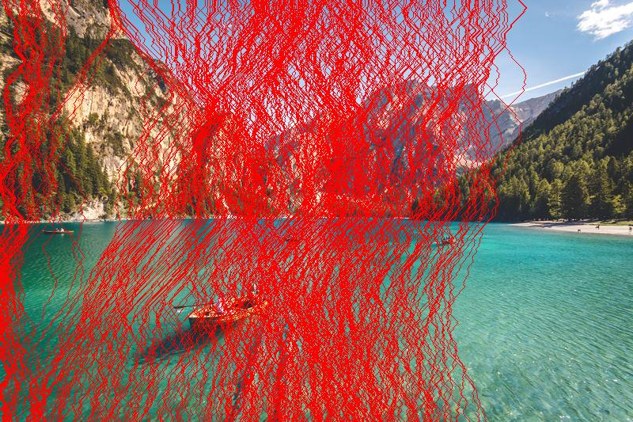

## 🖼️ Seam Carving Implementation  

### 📌 Overview  
This repository contains an implementation of **Seam Carving** for **content-aware image resizing**. The project includes both the **original (unoptimized)** and **optimized** versions of the algorithm, demonstrating significant performance improvements.  

✅ **Lab Assignment 1 - Computer Vision Course**  
🚀 **Optimized Version is ~50x Faster than the Original!**  

---

## 📂 Repository Structure  

```
seam_carving_implementation/    # Root of the repository
│── images/                     # Input & output images
│   │── input.jpg               # Original input image
│   │── output_resized.jpg      # Resized image after seam carving
│   │── output_seams.jpg        # Visualization of removed seams
│
│── notebooks/                  # Jupyter Notebooks for execution
│   │── The_assignment_lab_1.ipynb  # Main implementation notebook
│   │── colab_link.txt              # File containing Colab execution link
│
│── src/                        # Source code for seam carving
│   │── seam_carving_before.py  # Unoptimized version (slow)
│   │── seam_carving_optimized.py   # Optimized version (fast)
│
│── benchmarking/               # Performance comparison logs
│   │── benchmark_results.md    # Detailed benchmark results
│   │── execution_time.txt      # Exection time report
│
│── README.md                   # Project documentation
│── requirements.txt             # Dependencies file
```

---

## 🚀 **Performance Improvement**  
We optimized the original seam carving algorithm, reducing the execution time **from 339.09 seconds to just 6.74 seconds** (~50x improvement).  

| Version                 | Execution Time (Seconds) | Improvement |
|-------------------------|------------------------|-------------|
| 🔴 **Before Optimization** | 339.09 sec             | -           |
| 🟢 **After Optimization**  | 6.74 sec               | 🚀 **~50x Faster!** |

### **🔬 Key Optimizations Applied**  
✅ **Efficient Data Structures**: Improved memory management and matrix operations.  
✅ **Algorithm Enhancements**: Reduced redundant calculations and improved energy map updates.  
✅ **Parallel Processing**: Removed unnecessary nested loops to enhance performance.  

For a **detailed benchmark report**, check 👉 [`benchmark_results.md`](benchmarking/benchmark_results.md).

---

## 📷 **Example Results**  

| **Original Image**  | **Resized Image** | **Seam Visualization** |
|--------------------|------------------|----------------------|
|  |  |  |

---

## 📌 **How to Run the Code**  

### ✅ **Run on Google Colab**  
👉 [Open the Notebook](https://colab.research.google.com/drive/1ENwh5IcX_4pQ3heDQTbIoKCBQdCvlfaO?usp=sharing)  

### ✅ **Run Locally (Python)**  

1. **Clone the repository**  
   ```bash
   git clone https://github.com/mostafatarek2003/seam_carving_implementation.git
   cd seam_carving_implementation/src
   ```

2. **Install dependencies**  
   ```bash
   pip install -r requirements.txt
   ```

3. **Run the unoptimized version**  
   ```bash
   python seam_carving_before.py
   ```

4. **Run the optimized version**  
   ```bash
   python seam_carving_optimized.py
   ```

---

## 🛠️ **Future Improvements**  

🔹 **GPU Acceleration** using CUDA for even faster processing  
🔹 **Interactive Web App** for real-time seam carving  
🔹 **Support for Video Seam Carving**  

---

## 🤝 **Contributors**  

📌 **Mostafa Tarek Khamis**  
📌 **Mazen Seif Eldin**  
📌 **Ahmed Attia Abo Elnaga**  

💡 **Contributions**: Implemented seam carving, optimized performance, and structured the repository.  

---
